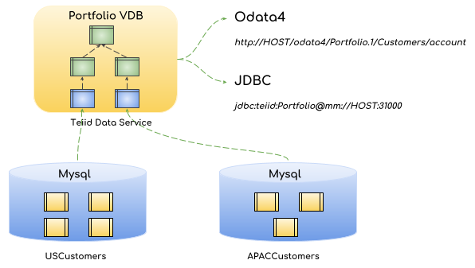
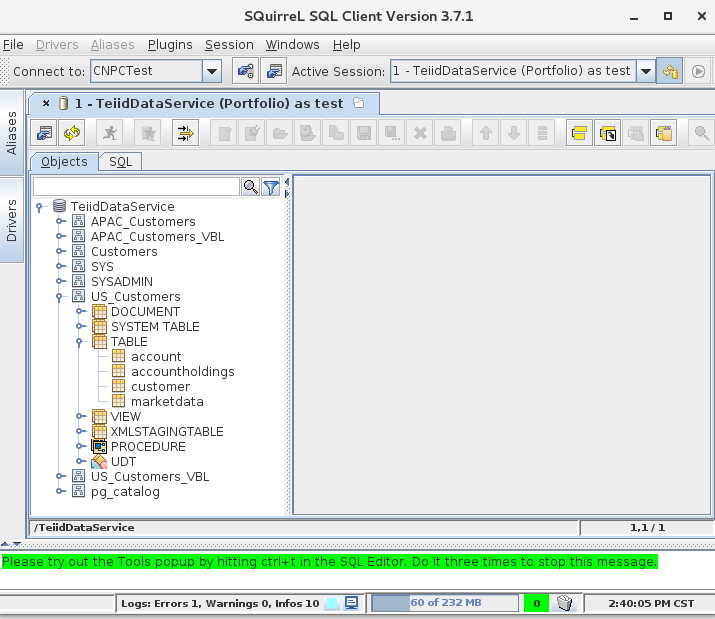

= VDB Data Federation
:toc: manual
:toc-placement: preamble

This example demonstrates:

* How to expose multiple data sources for data federation and how to expose as a real time data service.
* How to compose data via layer based view design pattern.
* How to connect multiple data stores and develop VDB service with cloud native enable and microservice enable modern application development way.

== Overview

As above figure, the customers data are currently spread over several databases, one for US Customers data, another for APAC Customers data, the data model in different databases are similar, but there are some difference, for example, the `account` table in `apaccustomers` database use *CustID* represent Customer ID, and in `uscustomers` the *SSN* represent the Customer ID. Some columns data type are also different in different databases. In this example:

* The jdbc connector used to connect the databases.
* The layer based view design pattern create different layers for data composing, the `Virtual Base Layer` is just a series of views that have one-to-one correspendence to each of the source tables; the `Enterprise Data Layer` is resolve the slight semantic differences between the `apaccustomers` and `uscustomers` databases; the `Federated Data Layer` is unite the data between different databases virtually.
* The Teiid Data Service is a microservice base on cloud native and modern application development pattern to supply JDBC and OData entrypoint for Data consuming. 

> Please raise any issues found with this example in our JIRA:
> https://issues.jboss.org/projects/TEIID

== Project Setup

IMPORTANT: This example requires Java 8 JDK or greater and Maven 3.3.x.

The project is a maven project with `vdb` packaging. This is special packaging developed for Teiid based VDB. The `pom.xml` is the key file for building a WFS based application. To enable `vdb` packing you need to add following to your pom.xml

[source,xml]
----
<packaging>vdb</packaging>

<build>
  <plugins>
      <plugin>
        <groupId>org.teiid</groupId>
        <artifactId>vdb-maven-plugin</artifactId>
        <version>1.1</version>
                ... see more in pom.xml file
      </plugin>
  </plugins>
</build>
----

This project also require `wildfly-swarm-plugin` to build a uber jar with `-swarm.jar` extension, for that add the following

[source,xml]
----
<build>
  <plugins>
      <plugin>
        <groupId>org.wildfly.swarm</groupId>
        <artifactId>wildfly-swarm-plugin</artifactId>
        <version>${version.wildfly.swarm}</version>
                ... see more in pom.xml file
      </plugin>
   </plugins>
</build>
----

The project also require `fabric8-maven-plugin` to deploy the example to Kubernetes or OpenShift, for that add the following

[source,xml]
----
<build>
  <plugins>
      <plugin>
        <groupId>io.fabric8</groupId>
        <artifactId>fabric8-maven-plugin</artifactId>
        <version>${version.io.fabric8}</version>
                ... see more in pom.xml file
      </plugin>
   </plugins>
</build>
----

This project depends on Teiid Fraction and eiid's JDBC translator in WFS, then add the following dependencies

[source,xml]
----
<dependency>
  <groupId>org.wildfly.swarm</groupId>
  <artifactId>teiid</artifactId>
</dependency>

<dependency>
  <groupId>org.wildfly.swarm</groupId>
  <artifactId>teiid-jdbc</artifactId>
</dependency>
----

Since we are using the MySQL database, we would need to add dependency on MySQL JDBC driver by adding the following

[source,xml]
----
<dependency>
    <groupId>mysql</groupId>
    <artifactId>mysql-connector-java</artifactId>
    <version>${mysql.version}</version>
</dependency>
----

if you want your Teiid instance to expose OData API, then add the following dependency

[source,xml]
----
<dependency>
  <groupId>org.wildfly.swarm</groupId>
  <artifactId>odata</artifactId>
</dependency>
----

== VDB Setup

WFS based Teiid currently only supports XML/DDL based VDBS with -vdb.xml extension. Develop your VDB completely using Desginer perhaps or simply using a text editor, once done place the VDB file in `src/main/vdb` folder.

== OpenShift Project Setup

A Openshift or Minishift should be started, a oc client should be installed on your local machine, execute the following commands to login into OpenShift and create a new project.

[source, bash]
----
$ oc login https://192.168.42.107:8443 -u developer -p developer
$ oc new-project teiid-data-service
----

==  APAC Database Setup

[source, bash]
.*Create mysql app*
----
$ oc new-app --docker-image=registry.access.redhat.com/rhscl/mysql-57-rhel7:latest --name=mysql-apaccustomers -e MYSQL_USER=test_user -e MYSQL_PASSWORD=test_pass -e MYSQL_DATABASE=apaccustomers -e MYSQL_ROOT_PASSWORD=redhat
----

[source, bash]
.*Sample data*
----
$ oc port-forward mysql-apaccustomers-1-jb1rb 13306:3306
$ mysql -h127.0.0.1 -utest_user -ptest_pass -P13306 apaccustomers < src/main/sql/apaccustomers-mysql.sql
----

NOTE: `oc get pods` can get the pod name which used in above commands, a new terminal should be open for sample data to mysql. To test or verify the sample data, use the `mysql -h127.0.0.1 -utest_user -ptest_pass -P13306 apaccustomers -e SQL` can execute sql query.

NOTE: Although mysql with RedHat cloud native storage(https://access.redhat.com/products/red-hat-ceph-storage[Ceph], https://access.redhat.com/products/red-hat-storage[GlusterFS]) are used frequent by Red Hat Customer, some database like Oracle which lack of cloud native capabilities are not recommend to run on cloud.

==  US Database Setup

[source, bash]
.*Create mysql app*
----
$ oc new-app --docker-image=registry.access.redhat.com/rhscl/mysql-57-rhel7:latest --name=mysql-uscustomers -e MYSQL_USER=test_user -e MYSQL_PASSWORD=test_pass -e MYSQL_DATABASE=uscustomers -e MYSQL_ROOT_PASSWORD=redhat
----

[source, bash]
.*Sample data*
----
$ oc port-forward mysql-uscustomers-1-9p7g8 13307:3306
$ mysql -h127.0.0.1 -utest_user -ptest_pass -P13307 uscustomers < src/main/sql/uscustomers-mysql.sql
----

NOTE: `mysql -h127.0.0.1 -utest_user -ptest_pass -P13307 apaccustomers -e SQL` can used to test or verify the sample data.

== Teiid Data Service

[source, bash]
.*Run locally*
----
$ mvn clean package
$ java -Dswarm.datasources.data-sources.APAC_CU_DS.connection-url=jdbc:mysql://127.0.0.1:13306/apaccustomers \
       -Dswarm.datasources.data-sources.APAC_CU_DS.user-name=test_user \
       -Dswarm.datasources.data-sources.APAC_CU_DS.password=test_pass \
       -Dswarm.datasources.data-sources.APAC_CU_DS.driver-name=mysql \
       -Dswarm.datasources.data-sources.US_CU_DS.connection-url=jdbc:mysql://127.0.0.1:13307/uscustomers \
       -Dswarm.datasources.data-sources.US_CU_DS.user-name=test_user \
       -Dswarm.datasources.data-sources.US_CU_DS.password=test_pass \
       -Dswarm.datasources.data-sources.US_CU_DS.driver-name=mysql \
       -DAB_JOLOKIA_OFF=true -jar target/vdb-service-1.0.0-swarm.jar
----

Once the WFS uber jar started correctly, refer to <<Query Demonstrations, Query Demonstrations>> for data query demonstrations.

[source, bash]
.*Run on OpenShift*
----
$ mvn clean fabric8:deploy -Popenshift
----

Once the fabric8 deploy success, use the `watch oc get all` to monitor the OpenShift S2I, deployment, once everthing is done refer to <<Query Demonstrations, Query Demonstrations>> for data query demonstrations.

[source, bash]
.*Run on docker*
----
$ docker build -t vdb-datafederation-swarm .
$ docker tag vdb-datafederation-swarm teiid/vdb-datafederation-swarm:1.0
$ docker run -p 31000:31000 8080:8080 teiid/vdb-datafederation-swarm:1.0 -e swarm.datasources.data-sources.APAC_CU_DS.connection-url=jdbc:mysql://127.0.0.1:13306/apaccustomers \
       -e swarm.datasources.data-sources.APAC_CU_DS.user-name=test_user \
       -e swarm.datasources.data-sources.APAC_CU_DS.password=test_pass \
       -e swarm.datasources.data-sources.APAC_CU_DS.driver-name=mysql \
       -e swarm.datasources.data-sources.US_CU_DS.connection-url=jdbc:mysql://127.0.0.1:13307/uscustomers \
       -e swarm.datasources.data-sources.US_CU_DS.user-name=test_user \
       -e swarm.datasources.data-sources.US_CU_DS.password=test_pass \
       -e swarm.datasources.data-sources.US_CU_DS.driver-name=mysql
----

Once the docker container started, refer to <<Query Demonstrations, Query Demonstrations>> for data query demonstrations.

== Query Demonstrations

To test the jdbc query, execute the `oc port-forward vdb-service-1-xsf9b 31100:31000` to forward the port, the use `jdbc:teiid:Portfolio@mm://127.0.0.1:31100;version=1` to create the JDBC Connection. The below is the welcome page of http://squirrel-sql.sourceforge.net/[Squirrel SQL Client]:

From the figure, there are layers view model like `APAC_Customers`, `APAC_Customers_VBL`, `US_Customers`, `US_Customers_VBL`, the `Customers` is the top union model.

[source, sql]
.*Example - SQL*
----
SELECT * FROM APAC_Customers.account
SELECT * FROM APAC_Customers_VBL.account
SELECT * FROM US_Customers.account
SELECT * FROM US_Customers.marketdata
SELECT * FROM US_Customers_VBL.account
SELECT * FROM Customers.account
----

To test the OData query, you need first get the hostname and port, if run locally, the `127.0.0.1:8080` is a valid host, if run on Openshift, the `oc get routes` can ge the host url.

[source, text]
.*Example - URL*
----
http://${HOSTS}/odata4/Portfolio.1/APAC_Customers/$metadata
http://${HOSTS}/odata4/Portfolio.1/US_Customers/$metadata
http://${HOSTS}/odata4/Portfolio.1/APAC_Customers_VBL/$metadata
http://${HOSTS}/odata4/Portfolio.1/US_Customers_VBL/$metadata
http://${HOSTS}/odata4/Portfolio.1/Customers/$metadata

http://${HOSTS}/odata4/Portfolio.1/APAC_Customers/account?$format=JSON
http://${HOSTS}/odata4/Portfolio.1/APAC_Customers_VBL/account?$format=JSON
http://${HOSTS}/odata4/Portfolio.1/US_Customers/account?$format=JSON
http://${HOSTS}/odata4/Portfolio.1/US_Customers/marketdata?$format=JSON
http://${HOSTS}/odata4/Portfolio.1/US_Customers_VBL/account?$format=JSON
http://${HOSTS}/odata4/Portfolio.1/Customers/account?$format=JSON
----

